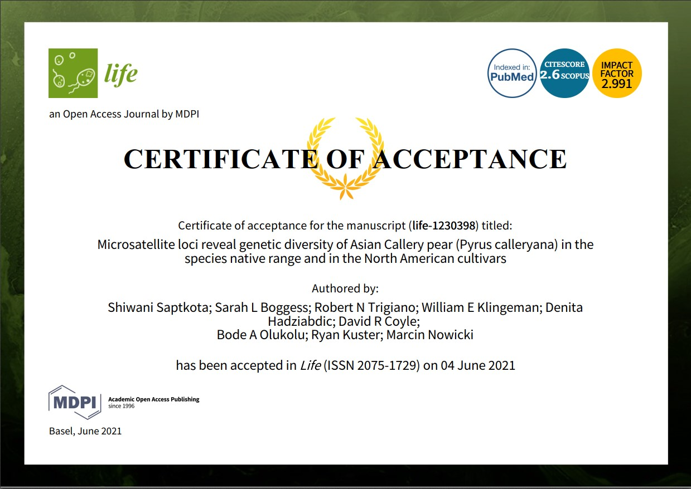

## 3rd paper out in 2021

This had to finish like this.

More often than not, human-based dispersal of ornamental species is, what leads to new problems. Many wish to have something new, something exciting in their home gardens, which was just the case of 'Bradford' pear as well.

On one hand, invasive species like _P. calleryana_ provide my job security. On the other hand, their spurs (thorns) reaching even 8 cm in length can pop tractor tiers ($1,000). Add to that their prolific colonization of forests and unmanaged urban areas, and you've got yourself a career in invasive species management.

Enter [Shiwani](database/projects/2020/Pyrus-calleryana-SFRA-2019/Pyrus-calleryana-SFRA-2019.md).

As my first MS student, she tackled _P. calleryana_ in several aspects. The fruits of the first sub-projects were just [accepted to MDPI Life](/Life.jpg), special issue on [Biological Invasions and Biodiversity](https://www.mdpi.com/journal/life/special_issues/biological_invasions_biodiversity). Further, the paper Shiwani leads was chosen to be the Feature Paper for that issues, #CongratsShiwani .

In this report, we analyzed the genetic diversity of native Asian samples, and those from US developed ornamental cultivars. Our molecular data support what was noted in breeding history: That the cultivars are most closely related to their Chinese forebears. But also, we underscore that contrary to expectations, the cultivars were NOT genetically identical.

So on top of the species being well-posed to be ecological threat and great invader, humans helped increase the starting genetic pool. 

We're now finalizing the second and third steps of that journey, and let me tell you - we WILL be busy...

